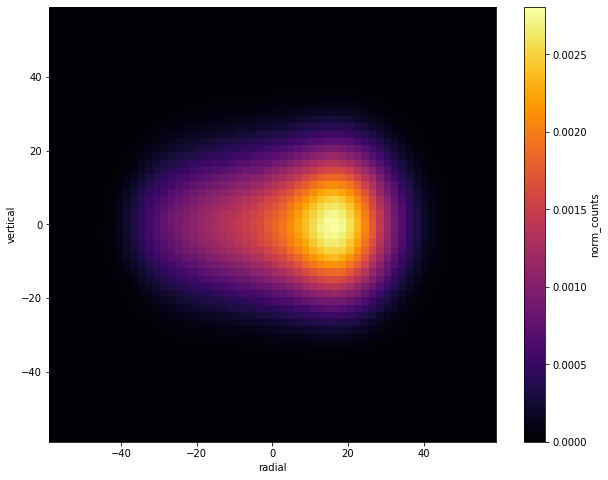
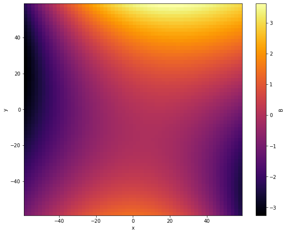
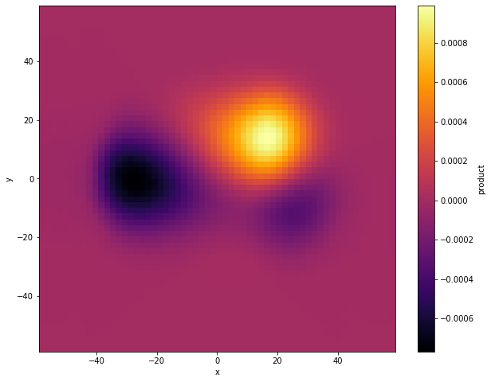

# Muon-Weighted Magnetic Field Averaging

Analysis code from the **Fermilab Muon g-2 experiment**, the collaboration awarded the **2026 Breakthrough Prize in Fundamental Physics**. This repository computes the average magnetic field experienced by the muon beam, one of the inputs needed to extract the muon's anomalous magnetic moment.

> **About this snapshot.** This is real collaboration analysis code I wrote in 2019 and 2020, prepared here for public viewing. Internal database connection details have been redacted and the experiment's datasets are not included, so the notebooks illustrate the methods rather than run end to end. The science and the structure are described below.

## The problem

Muons travel through a magnetic field that varies in space and time, on complicated trajectories. The measurement needs the field *the muons actually experience*, which means the field weighted by where the muons are.

Concretely:

1. Build a 2D distribution of the muon beam from tracker data:

   

2. Build a 2D map of the magnetic field from the field team's multipole expansions:

   

3. Take the element-wise product to see where the contributions to the average come from, then integrate to get the muon-weighted average field:

   

## What I built

- **Two complementary averaging methods.** A direct spatial "grid" method and a "moments" method, with a reusable library (`field_info/`, `synthesis/`) to resample the field, beam, and detector-acceptance distributions onto common grids. Start with [`grid_tutorial.ipynb`](grid_tutorial.ipynb) and [`moments_tutorial.ipynb`](moments_tutorial.ipynb).
- **Systematic uncertainty studies** (`analysis/systematics/`). How the averaged field shifts under beam motion, closed-orbit distortions, and ctag- and field-related errors. This is what turns a number into a number with a defensible uncertainty.
- **A Run-1 pipeline** (`analysis/run1_pipeline/`) that computed the muon-weighted field and its error across the full Run-1 dataset. An earlier version produced results presented at a Fermilab collaboration meeting in fall 2019.
- **Data plumbing** (`muon_info/`, `tracker_info/`). Code to pull muon counts and timing from the experiment's database and to read and transform the field and tracker inputs into a common format.

## Repository layout

| Path | What it is |
| --- | --- |
| `grid_tutorial.ipynb`, `moments_tutorial.ipynb` | the two averaging methods, explained step by step |
| `field_info/`, `synthesis/` | the reusable grid and resampling library |
| `tracker_info/` | beam-moment extraction and coordinate transforms |
| `muon_info/` | database access for muon timing and counts |
| `analysis/systematics/` | systematic-uncertainty evaluations |
| `analysis/run1_pipeline/` | the full-Run-1 field-averaging pipeline |
| `background/calculation/` | derivation notes for the averaging method |

The `.py` modules are the reusable pieces. The notebooks demonstrate and validate them. Built with Python 3, NumPy, pandas, Matplotlib, and psycopg2.

## About the prize

The 2026 Breakthrough Prize in Fundamental Physics was awarded to the Muon g-2 collaborations at CERN, Brookhaven, and Fermilab, recognizing three generations of the experiment and the final Fermilab measurement of the muon's anomalous magnetic moment to 127 parts per billion. I was a research fellow on the Fermilab experiment and a member of the collaboration. This repository is one slice of that work.

## Author

Jason Bono

## License

Released under the MIT License. See [LICENSE](LICENSE).
